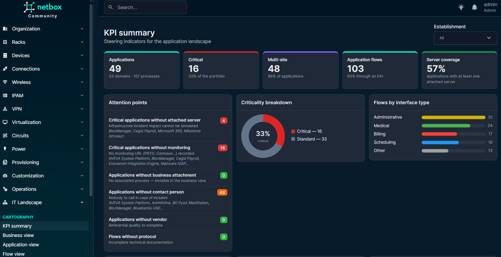
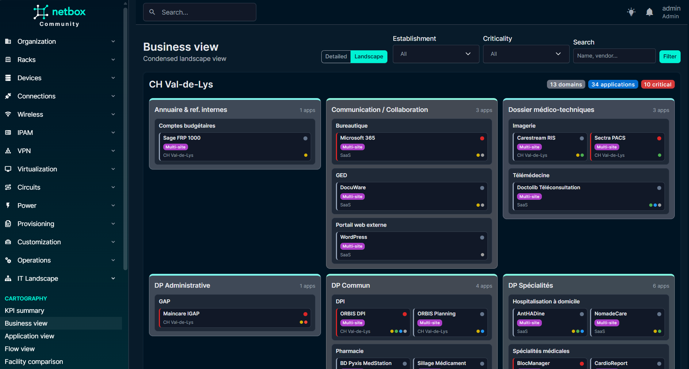
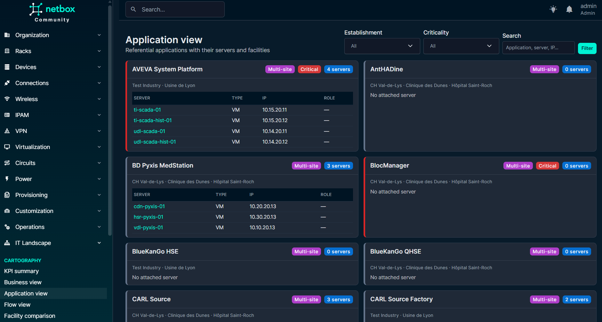
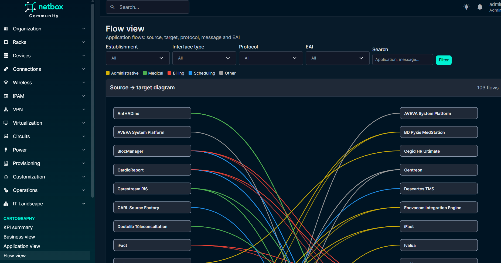
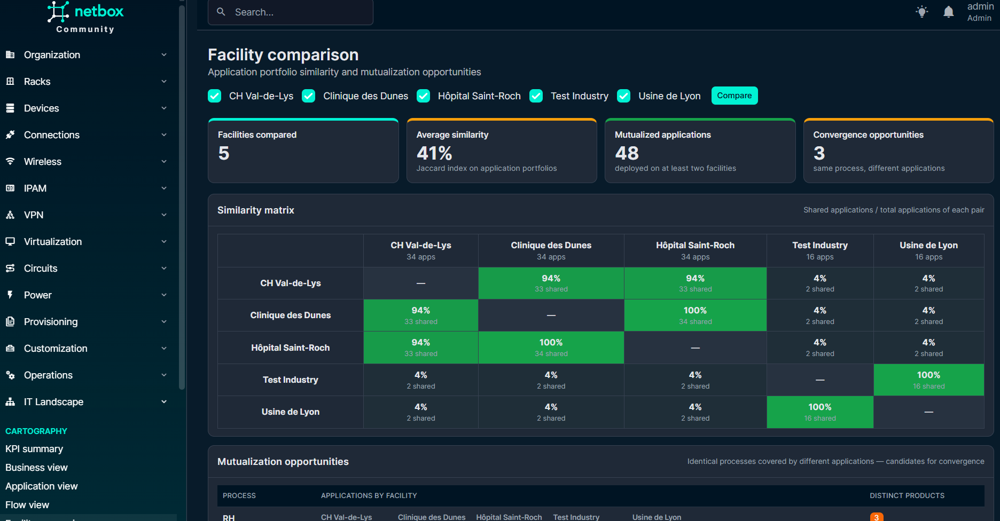

# netbox-it-landscape

🇫🇷 [Version française](README.fr.md)

NetBox plugin for **application landscape cartography**, a native integration
of the [it-landscape](https://github.com/lquastana/it-landscape) project
features: **business**, **application** and **flow** views — plus KPI
dashboards, facility comparison and a setup wizard.

## Why a plugin?

The original it-landscape project runs *next to* NetBox (API reads + `app:XXX`
tags). This plugin moves the cartography *inside* NetBox:

| it-landscape concept | In the plugin |
|---|---|
| Facility | **NetBox Site** (native) |
| Business domain | `BusinessDomain` model (attached to the site) |
| Process | `BusinessProcess` model |
| Application (criticality, interfaces…) | `Application` model — **unique in the referential**, attached to N processes |
| `multiEtablissement` flag | **Derived**: an application linked to processes of several sites is multi-site |
| Trigram (JSON join key) | **Removed** — replaced by real relations (FK / M2M) |
| Application flow (protocol, message, EAI…) | `ApplicationFlow` model (with facility FK) |
| Servers linked by `app:XXX` tag | **Direct M2M relations** to VM / Device |

Native integration benefits: NetBox changelog and journal on every object,
per-object permissions, global search, REST API + filters, custom fields,
tags, and contextual panels injected on Site / VM / Device pages.

## Features

- **Business view** (`/plugins/it-landscape/metier/`): facilities → colored
  domains → processes → application cards with criticality and active
  interfaces. Detailed mode and condensed, print-friendly **landscape mode**.
- **Application view** (`/plugins/it-landscape/applicatif/`): referential
  applications with their servers (VMs/devices), IPs and roles.
- **Flow view** (`/plugins/it-landscape/cartographie-flux/`): filterable table
  (facility, interface, protocol, EAI) + source → target SVG diagram colored
  by interface type.
- **KPI summary** (`/plugins/it-landscape/synthese/`): key counters, attention
  points (critical apps without server/monitoring…), EAI dependency, most
  connected applications, top vendors.
- **Facility comparison** (`/plugins/it-landscape/comparaison/`): similarity
  matrix (Jaccard), already-mutualized applications, **convergence
  opportunities** (same process, different applications), facility-specific
  applications.
- **Cascade impact simulator** (`/plugins/it-landscape/cascade/simulateur/`):
  build an incident scenario from one or more failed components (application,
  flow, VM, device, hosting provider) with a severity each; the impact is
  propagated through application flows and reported as impacted applications
  and processes grouped by site, blocked flows, causes and recommended
  actions.
- **Authentication mapping (indicator PROC-09A)**: each application records
  the **authentication modes** it exposes (local, local IdP delegation,
  Pro Santé Connect, HospiConnect banner, none), an optional primary mode, a
  "mapping maintained" flag and a maintenance/IdP note — the cartography
  required by the digital health security indicator **PROC-09A**
  (HospiConnect / HOP'EN 2). Editable in the UI and the REST API, filterable
  and CSV-exportable. The KPI summary derives a **0→4 maturity level** per
  facility (`maturity.proc09a_level`) with an attention point on undocumented
  applications.
- **Setup wizard** (`/plugins/it-landscape/initialisation/`): ready-to-use
  modeling bundles — **Hospital IS (SIH)** (admissions, EHR, pharmacy,
  imaging… with HL7/DICOM flows through an EAI) and **Manufacturing** (ERP,
  MES, SCADA, WMS… with OPC-UA/EDI flows through an ESB) — domain/process
  structure + sample applications, VLANs, VMs and flows, in one click.
- **Multilingual**: English interface with a full French translation
  (follows the NetBox user language preference).
- **Full CRUD**: domains, processes, applications, flows (forms, filters,
  bulk delete, changelog, journal).
- **REST API**: `/api/plugins/it-landscape/…` (4 endpoints, filters included).
- **NetBox global search**: applications, flows, domains, processes indexed.
- **Contextual panels**: applications shown on VM / Device pages, cartography
  summary on the Site page.
- **it-landscape data import**: `import_it_landscape` management command.

## Screenshots

### KPI summary



### Condensed business landscape



### Application view



### Flow view



### Facility comparison



## Installation

```bash
pip install netbox-it-landscape   # or pip install -e /path/to/the/repo
```

In `configuration.py` (or `/etc/netbox/config/plugins.py` with netbox-docker):

```python
PLUGINS = ["netbox_it_landscape"]
```

Then:

```bash
python manage.py migrate
```

### Development with the it-landscape Docker stack

The `docker-compose.override.yml` file provided in the it-landscape repository
mounts this plugin into the NetBox container, installs it in editable mode and
enables it. From the it-landscape repository:

```bash
docker compose --profile netbox up -d --force-recreate netbox
```

## Importing existing data

The it-landscape project JSON files (`<facility>.json`, `<facility>.flux.json`,
`<facility>.infra.json`, `trigrammes.json`) can be imported in one command:

```bash
python manage.py import_it_landscape /opt/it-landscape-data --create-sites --with-infra
```

- **Sites** are resolved by name (`--create-sites` creates missing ones).
- Applications are **unified by name**: an application present in several
  facilities becomes a single multi-site record. Trigrams from the JSON files
  are only used as a resolution key during import.
- `--with-infra` also creates the test infrastructure: **VMs** (vCPU, RAM,
  disk, eth0 interface, primary IP, `app:XXX` tag) from `*.infra.json`,
  **VLANs, prefixes and gateways** from `*.network.json`.
- **NetBox VMs** are attached to applications via the `*.infra.json` files.
- Applications referenced only by flows (EAI, monitoring…) are created in an
  "Out of business referential" domain.
- The command is **idempotent** (safe to re-run, no duplicates).

## Compatibility

- NetBox ≥ 4.0 (tested on 4.3)
- Python ≥ 3.10

## License

MIT
